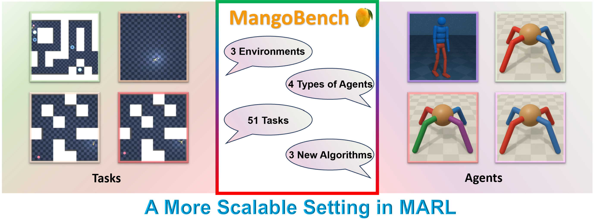

<div id="user-content-toc">
  <ul align="center" style="list-style: none;">
    <summary>
      <h1>MangoBench: Benchmarking Multi-Agent Goal-Conditioned Offline Reinforcement Learning</h1>
    </summary>
  </ul>
</div>

<div align="center">



</div>

# Abstract
Goal-conditioned offline reinforcement learning is an important field in modern reinforcement learning for its simplicity and universality.It is especially essential in multi-agent settings, where manually designing or shaping rewards is notoriously difficult, and iteratively collecting experience through environmental interaction is both costly and risky. Despite its importance in multi-agent settings, there is currently a lack of algorithms. Therefore, we propose MangoBench, the first multi-agent goal-conditioned offline reinforcement learning benchmark. MangoBench consists of $3$ environments, $4$ types of agents, $51$ tasks with different levels of challenges and $3$ baseline algorithms designed by ourselves, including goal-conditioned multi-agent behavior cloning, independent contrastive reinforcement learning, and independent hierarchical implicit Q-learning. Experiments demonstrate that independent hierarchical implicit Q-learning emerges as the state-of-the-art algorithm for multi-agent offline goal-conditioned tasks among the three baseline algorithms. 

# Github Overview
MangoBench is a multi-agent goal-conditional offline RL benchmark. Our benchamrk is based on [MUJOCO](https://github.com/google-deepmind/mujoco),[MaMujoco](https://robotics.farama.org/envs/MaMuJoCo/index.html),[OGBench](https://seohong.me/projects/ogbench/).

# Comparison with other Multi-agent Benchmark
<div align="center">

</div>

# How to use the MANGOBench environments

### Installation

MangoBench follow the environment and datasets of [OGBench](https://seohong.me/projects/ogbench/), which can be easily installed via PyPI:

```shell
pip install ogbench
```

It requires Python 3.8+ and has only three dependencies: `mujoco >= 3.1.6`, `dm_control >= 1.0.20`,
and `gymnasium`.

### Quick start

After installing OGBench, you can create an environment and datasets using `ogbench.make_env_and_datasets`.
The environment follows the [Gymnasium](https://gymnasium.farama.org/) interface.
The datasets will be automatically downloaded during the first run.

#### How to use the reference implementations

 Jax-based reference implementations of the algorithms are shown as follows.
They are provided in the `impls` directory as a **standalone** codebase.
You can safely remove the other parts of the repository if you only need the reference implementations
and do not want to modify the environments.

Our reference implementations require Python 3.9+ and additional dependencies, including `jax >= 0.4.26`.
To install these dependencies, run:

```shell
cd impls
pip install -r requirements.txt
```

By default, it uses the PyPI version of OGBench.
If you want to use a local version of OGBench (e.g., for training methods on modified environments),
run instead `pip install -e ".[train]"` in the root directory.

### How to run and evaluate
We can directly run the code by running the bash file: ```bash impls/hyperparameters_multi.sh```
The evaluation results will be added to ```impls/exp```


### Algorithms
We offer three algorithms for baselines.

1. ICRL (Independent Contrastive Reinforcement Learning): Located in ```impls/agents/crl.py```
2. MAGCBC (Multi-agent Goal-Conditional Behaviour Cloning): Located in ```impls/agents/gcbc.py```
3. IHIQL (Independent Hierarchical Implicit Q-Learning): Located in ```impls/agents/hiql.py```


# WandB Evaluation
<div align="center">

</div>

# Results
<div align="center">

</div>
