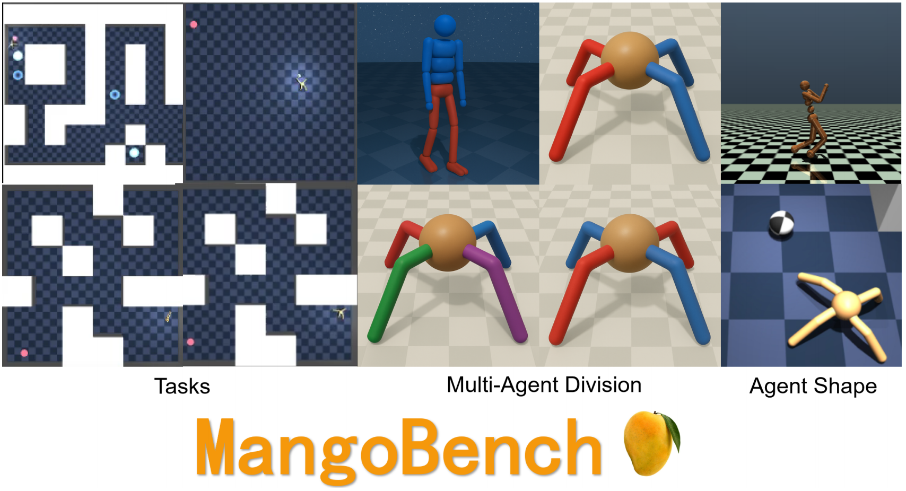
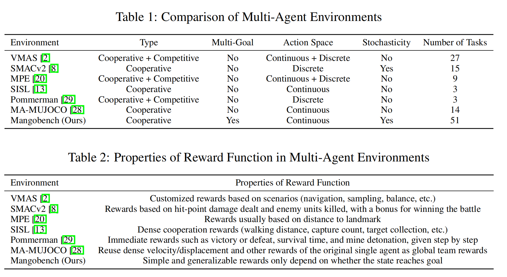
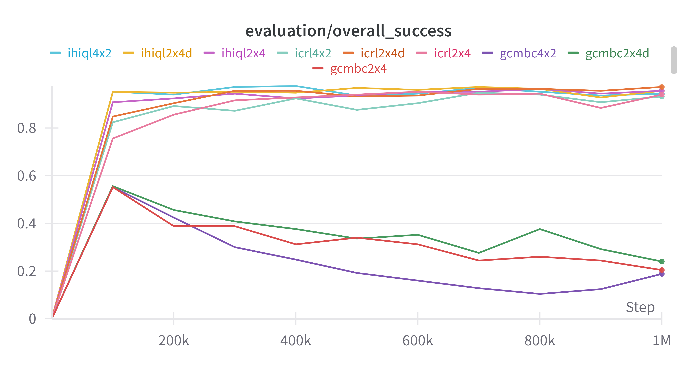
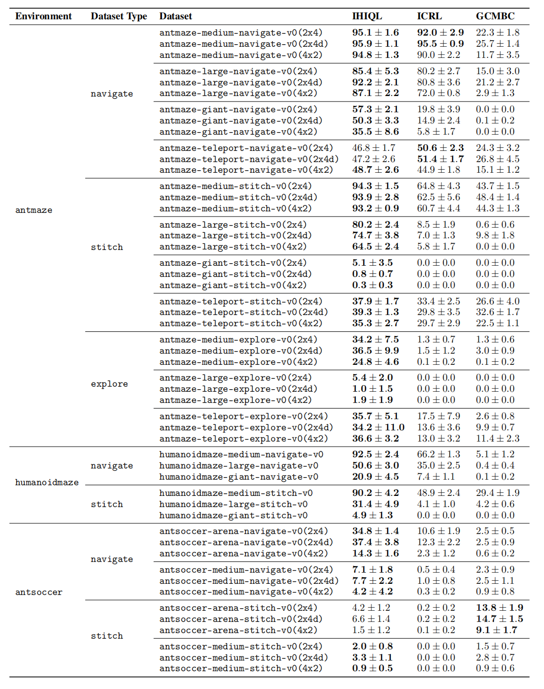

<div id="user-content-toc">
  <ul align="center" style="list-style: none;">
    <summary>
      <h1>MangoBench: Benchmarking Multi-Agent Goal-Conditioned Offline Reinforcement Learning</h1>
    </summary>
  </ul>
</div>

<div align="center">



</div>

# Overview

MangoBench is a multi-agent goal-conditional offline RL benchmark. Our benchamrk is based on [MUJOCO](https://github.com/google-deepmind/mujoco),[MaMujoco](https://robotics.farama.org/envs/MaMuJoCo/index.html),[OGBench](https://seohong.me/projects/ogbench/).

# Comparison with other Multi-agent Benchmark
<div align="center">

</div>

# How to use the MANGOBench environments

### Installation

MangoBench follow the environment and datasets of [OGBench](https://seohong.me/projects/ogbench/).


### Algorithms
We offer three algorithms for baselines.

1. ICRL (Independent Contrastive Reinforcement Learning): Located in ```impls/agents/crl.py```
2. MAGCBC (Multi-agent Goal-Conditional Behaviour Cloning): Located in ```impls/agents/gcbc.py```
3. IHIQL (Independent Hierarchical Implicit Q-Learning): Located in ```impls/agents/hiql.py```

### How to run the code
We can run the code by running the bash file: ```bash impls/hyperparameters_multi.sh```

# WandB Evaluation
<div align="center">

</div>

# Results
<div align="center">

</div>